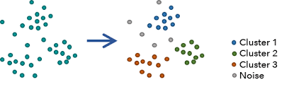
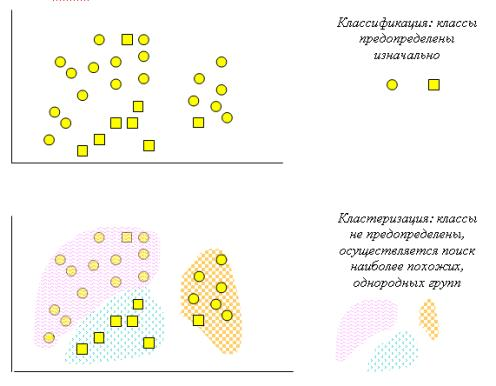
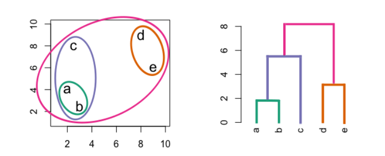
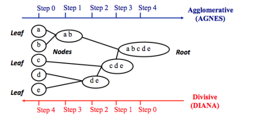

```{r setup, include=FALSE}
knitr::opts_chunk$set(echo = TRUE)

set.seed(42)

#install.packages(c("stats", "cluster", "factoextra", "clustertend", "dendextend", "NbClust", "fpc", "dbscan"))

library(dplyr)
library(ggplot2)
library(stats)
library(cluster)
library(factoextra)
library(clustertend)
library(dendextend)
library(NbClust)
library(fpc)
library(dbscan)

getwd()
```


*Кластеризация* - разбиение наблюдений на подмножества (кластеры) таким образом, чтобы наблюдения из одного кластера были более похожи друг на друга, чем на наблюдения из других кластеров по какому-либо критерию.



Кластеризация относится к моделям обучения без учителя. Т.е. мы можем либо не знать сколько у нас получится кластеров по итогам, либо (в ряде подметодов) контролировать их количество вручную:


Прежде чем начать, отметим ряд особенностей кластеризации:

Не существует универсального алгоритма кластеризации. Алгоритмов достаточно много. Сегодня мы расммотрим четыре самых популярных из них;
Нужно быть осторожным с интерпретацией кластерного анализа - далеко не всегда можно искренне считать, что получившиеся кластеры отражают структуру данных;
Данные должны быть нормированы
Отдельные кластеры можно выбраковывать
Cостав и количество кластеров зависит от выбираемых переменных. Изменение переменных влияет на кластеры
Данные о кластеризации полезны, если вы после успешной кластеризации будете присваивать данным переменную с номером кластера и работать с ней дальше при анализе.

/

Работать будем с данными двумя датасетами. Учебным датасет ирисов Фишера и реальными данными о страновых показателях [систем здравоохранения](https://www.kaggle.com/datasets/danevans/world-bank-wdi-212-health-systems).И в том и в другом случае мы будем наблюдать достаточно выраженные кластеры (что бывает далеко не всегда).

```{r}
# Ирисы
iris <- iris |> 
  select(is.numeric)

# Системы здравоохранения
hs <- read.csv('data/Health_systems.csv')
rownames(hs) <- hs$World_Bank_Name

# Уберём дамми переменные и переменную с большим количеством миссингов. Оставим только полностью заполненные строки
hs_num <- hs |> 
  select(-c(Country_Region, Province_State, World_Bank_Name, `Completeness_of_death_reg_2008.16`)) |> 
  na.omit()

# Стандартизируем объекты для подсчёта и переведём их матрицу
iris_scaled <- scale(iris)
hs_scaled <- scale(hs_num)
```


# Иерархическая кластеризация (hierarchical clustering)

В основном к ней относится два вида алгоритмов:

*Agglomerative Nesting (agnes)* - каждое наблюдение находит ближайшее себе по дистанции до него (по каждой из переменных). После нахождения первого соседа, начинатся следующий шаг, когда образовавшийся мини-кластер ищет другие ближайшие к ним кластеры/наблюдения. Так прохожит несколько шагов, пока все наблюдения не сольются в один кластер.

*Divisive Analysis Clustering (diana)* - обратный способ. Мы отталкиваемся от одного кластера всех наблюдений и ищем непохожие друг на друга наблюдения и делим один кластер на два. Затем алгоритм продолжается до конца.


“Длинна” дистанции обозначает меру схожести/разницы наблюдений - Высоту/Height (Крестовский остров ближе к Институт биоинформатики чем к Кудрово).



Мы будем рассматривать agnes.

### Типы дистанций:

euclidian - если признаки числовые, одинаково важны и в похожих шкалах
manhattan - для нелинейных связей, когда шкалы переменных сильно различаются и когда много выбросов
cosine - для дамми переменных (0,1) и когда важна не велечина признаков, а их соотношение
gower - для смешанных переменных

## 1. Создаем матрицу дистанций

```{r}
hs_dist <- dist(hs_scaled,
                method = "euclidean") # default

as.matrix(hs_dist)[1:6, 1:6]
```


```{r}
iris_dist <- dist(iris_scaled,
                  method = "euclidean")
as.matrix(iris_dist)[1:6, 1:6]
```

## 2. Высчитываем дендограмму кластеров 

Для иерахической кластеризации используется функция `hclust`

```{r}
hs_dist.hc <- hclust(hs_dist, 
                     method = "ward.D2") # default

```

## 3. Визуализируем дендограмму

```{r}
fviz_dend(hs_dist.hc, 
          cex = 0.6) # cex() - размер лейблов

# we don't know the number of clusters yet
```
## 4. Работа с дендрограмой

Как поделить дендрограмму на кластеры? Допустим, мы решили, что нам нужно 4 кластера, тогда:

```{r}
hs_dist.hc_k3 <- cutree(hs_dist.hc, 
                          k = 3) # Создаём вектор принадлежности к кластерам. 3 - количество кластеров

# Смотрим результат - first 4 rows
head(hs_dist.hc_k3, n = 4)

```
```{r}
table(hs_dist.hc_k3)
```
38 наблюдений (стран) вв первом кластере, 74 во втором и 12 в третьем


Можем установить линию тршэшхолда для кластеров вручную:

```{r}
hs_dist.hc_h20 <- cutree(hs_dist.hc, h=20)  # Создаём вектор принадлежности к кластерам. height = 20 - высота линии

# Смотрим результат
table(hs_dist.hc_h20)
```
Визуализация

1 варинт 

```{r}
fviz_dend(hs_dist.hc, 
          k = 3, # Задаём число кластеров
          cex = 0.5, # Задаем размер лейблов
          k_colors = c("#2E9FDF", "#E7B800", "#FC4E07"),
          color_labels_by_k = TRUE, # Соотнести цвета с кластерами
          rect = TRUE # Добавить "квадратик" вокруг групп
)
```
2 вариант 

```{r}
fviz_cluster(list(data = hs_dist, cluster = hs_dist.hc_h20),
             palette = c("#2E9FDF", "#E7B800", "#FC4E07"),
             ellipse.type = "convex", # Объединить кластеры элипсом
             repel = TRUE, # Избежать наслоения лейблов
             show.clust.cent = FALSE, # Показывать центр кластера
             ggtheme = theme_minimal())

# изменить на 5 случайных наблюдений из каждого кластера

```

3 вариант

```{r}
fviz_dend(hs_dist.hc, 
          k = 3, 
          cex = 0.5, 
          # k_colors = c("#2E9FDF", "#E7B800", "#FC4E07"),
          color_labels_by_k = TRUE, 
          rect = TRUE, 
          # rect_border = c("#2E9FDF", "#E7B800", "#FC4E07"), # Добавить цвет для границы "квадратика"
          rect_fill = TRUE) # Закрасить внутреннюю часть "квадратика"
```


4 вариант - горизонтальный

```{r}
fviz_dend(hs_dist.hc, 
          cex = 0.5, 
          horiz = TRUE)


# расширить график чтобы подписи были более читабельными можно например при сохранении с ggsave
```
5 вариант - Раскрашиваем горизонтальную дендрограмму

```{r}
fviz_dend(hs_dist.hc, 
          k = 3, 
          cex = 0.4, 
          horiz = TRUE, 
          k_colors = "jco",
          rect = TRUE, 
          rect_border = "jco", 
          rect_fill = TRUE)
```
6 варинт - круговая дендрограмма


```{r}
fviz_dend(hs_dist.hc, 
          cex = 0.5, 
          k = 3,
          k_colors = "jco", 
          type = "circular")
```

7 вариант - Древовидная дендрограмма

```{r}
fviz_dend(hs_dist.hc, 
          k = 3, 
          k_colors = "jco",
          type = "phylogenic", 
          repel = TRUE) # Избежать наслоения лейблов
```

8 вариант - Приближение на участок дендрограммы

```{r}
hc_plot <- fviz_dend(hs_dist.hc, 
                       k = 3, 
                       cex = 0.5, 
                       k_colors = "jco"
)
dend_data <- attr(hc_plot, 
                  "dendrogram") # Извлекаем данные по дендрограмме

# Разрезаем по высоте h = 20
dend_cuts <- cut(dend_data, h = 20)
# Смотрим верхнюю часть графика
fviz_dend(dend_cuts$upper)
```
Нижнюю мы сразу посмотреть не можем, т.к. мы теперь имеем дело с 3 независимыми дендрограммами…

9 вариант - Выведение отдельной ветви дендрограммы


```{r}
fviz_dend(dend_cuts$lower[[1]], 
          main = "Кластер 1")
```

```{r}
# Plot subtree 2
fviz_dend(dend_cuts[["lower"]][[2]][[2]][[1]], 
          main = "Кластер 2 (одна из нижних ветвей)")
```


Альтернативный способ анализа с помощью пакета cluster
cluster представляет также представляет удобный функционал для работы с деревьями. Его пример ниже:


```{r}
library(cluster)
# Agnes
hs.agnes <- agnes(x = hs_dist, 
                   stand = F, # Стандартизировать данные?
                   metric = "euclidean", 
                   method = "ward" )

# Diana
hs.diana <- diana(x = hs_dist, 
                   stand = F, 
                   metric = "euclidean")

fviz_dend(hs.agnes, cex = 0.6, k = 3)
```


```{r}
fviz_dend(hs.diana, cex = 0.6, k = 3)
```


# Partitioning Clustering

## kMeans

*Общая идея:*

1. Случайным образом задаём n-ое количество точек. Число n выбираем сами (как это сделать - ниже). Эти точки называем центроидами - геометрическими центрами кластеров
2. Для всех точек-наблюдений определяем, к какому центроиду они ближе. Благодаря этому, мы образуем кластер вокруг центроида
3. Перемещаем каждый центроид в геометрический центр точек его кластера (изначально же наблюдения включались просто по факту того, что центроид был ближе, а не “центральнее”)
4. Пересчитываем точки, которые в таком, новом положении центроида попали в его кластер
5. Курсируем между шагом 3 и 4 до тех пор, пока в результате нового движения ни одна из точек не поменяет принадлежность к какому-либо кластеру


Посмотрим движение центроида на [видео](https://www.youtube.com/watch?v=nXY6PxAaOk0)

…

А можно ли доверять такому способу кластеризации k-means?

Нет, всегда надо быть на чеку. Разберёмся почему на [этом сайте](https://www.naftaliharris.com/blog/visualizing-k-means-clustering/).

…

Считать kMeans просто:

```{r}
hs_kmean <- kmeans(hs_num,
                          centers = 3, # Количество центроидов-кластеров
                          iter.max = 10, # Максимальное количество итераций-шагов центроидов
                          nstart = 35) # Какое количество центроидов сгенерировать в начале? Потом автоматически алгоритм сократит их до числа centers, оставив только лучшие. Рекомендуется ставить между 25 и 50, чтобы найти стабильное решение

head(hs_kmean)
```

