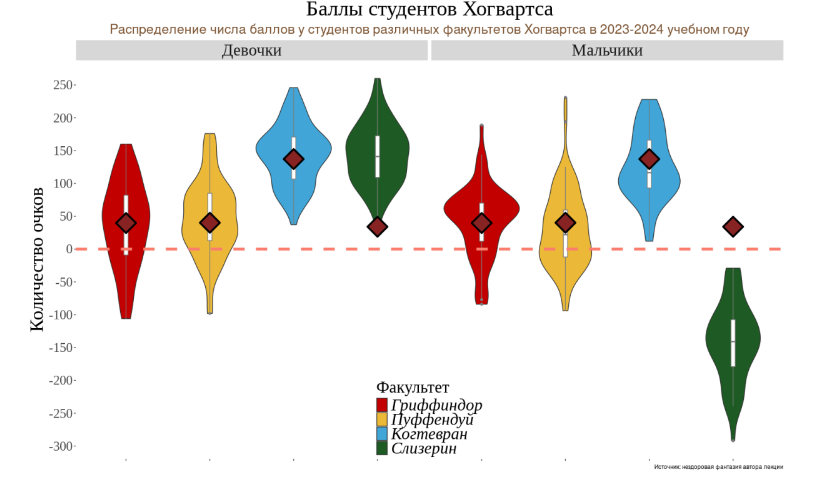

```{r setup, include=FALSE}
knitr::opts_chunk$set(echo = TRUE, warning = FALSE, message = FALSE)
library(tidyverse)
```

```{r}
hogwarts <- read_csv("data/hogwarts_2024.csv")

hogwarts <- hogwarts %>%
  rename_with(~ str_replace_all(., " ", "_"), contains("exam"))
```


# Диаграммы рассеяния (скаттерплоты)

##1. 
Постройте скаттерплот, визуализирующий связь между суммарным
баллом студента за год и оценкой за экзамен по травологии. Добавьте на
график линию тренда. Удалите доверительную область и сделайте линию
прямой. Подумайте, как избежать того, чтобы записать одни и те же
координаты x и y дважды. Проинтерпретируйте график. (1 б.)

```{r}
ggplot(hogwarts, aes(x = result, y = Herbology_exam)) +
  geom_point() +
  geom_smooth(method = "lm", 
              se = FALSE) +
  theme_minimal()

```
*Связь между тавологией и суммарным баллом - прямопропорциональная. *


##2.
Отобразите на одном графике скаттерплоты, аналогичные тому, что вы
делали на первом задании, для экзаменов по травологии, магловедению,
прорицаниям и зельеварению. На графике так же должна присутствовать
линия тренда с характеристиками, аналогичными тем, что были в пункте 1.
Раскрасьте точки на графике в разные цвета, в соответствии с
факультетами. Используйте стандартные цвета факультетов (как в
лекционных rmd). Проинтерпретируйте график. (1 б). Если вы создадите
график из этого пункта, используя только пакеты семейства tidyverse, и не
привлекая дополнительные средства, вы получите дополнительные 0.5 б.


```{r}
hogwarts %>%
  pivot_longer(cols = c(Herbology_exam, Muggle_studies_exam, Charms_exam, Potions_exam), 
               names_to = "Exam", values_to = "Score") %>%
  ggplot(aes(x = result, y = Score, color = house)) +  # color (not fill) because it is geom_point, it doesn't have filled areas
  geom_point() +
  geom_smooth(aes(group = 1), method = "lm", se = FALSE, color = "black") +
  scale_color_manual(
    values = c(
      "Gryffindor" = "#C50000", 
      "Hufflepuff" = "#ECB939", 
      "Ravenclaw" = "#41A6D9", 
      "Slytherin" = "#1F5D25"
    ),
    labels = c(
      "Gryffindor" = "Гриффиндор",
      "Hufflepuff" = "Хаффлпафф",
      "Ravenclaw" = "Когтевран",
      "Slytherin" = "Слизерин"
    )
  ) + 
  labs(y = "Результат экзамена", x = "Суммарный балл за год",
       color = "Факультет") +
  theme_minimal()
```
На совсем понятна формулировка задания, поэтому сделаю также фасетирование.


```{r}
hogwarts %>%
  pivot_longer(cols = c(Herbology_exam, Muggle_studies_exam, Charms_exam, Potions_exam), 
               names_to = "Exam", values_to = "Score") %>%
  ggplot(aes(x = result, y = Score, color = house)) +  
  geom_point() +
  geom_smooth(aes(group = 1), method = "lm", se = FALSE, color = "black") +
  
  # Facet the plot by Exam
  facet_wrap(~Exam, scales = "free_y",  labeller = as_labeller(c("Herbology_exam" = "Травоведение",
                                                                 "Muggle_studies_exam"= "Магловедение",
                                                                  "Charms_exam" = "Прорицания",
                                                                  "Potions_exam" = "Зельеварению"))) +  
  
  scale_color_manual(
    values = c(
      "Gryffindor" = "#C50000", 
      "Hufflepuff" = "#ECB939", 
      "Ravenclaw" = "#41A6D9", 
      "Slytherin" = "#1F5D25"
    ),
    labels = c(
      "Gryffindor" = "Гриффиндор",
      "Hufflepuff" = "Хаффлпафф",
      "Ravenclaw" = "Когтевран",
      "Slytherin" = "Слизерин"
    )
  ) + 
  labs(y = "Результат экзамена", x = "Суммарный балл за год",
       color = "Факультет") +
  theme_minimal()

```

*Суммарный балл за год прямопропорционален оценке за экзамен по травологии, магловедению и прорицанием. Суммарный балл за год обратно пропорционален оценке за экзамен по зельюварению. При этом студенты  Слизерина выделяются из общей массы: результаты по зельеварению у них высокие как при низких суммарных баллах, так и при высоких.*


##3. 
Видоизмените предыдущий график. Сгруппируйте и покрасьте линии
тренда в соответствии с одной из категориальных переменных (с такой,
которая подсвечивает одно из наблюдений на предыдущем этапе,
относящееся ко всем 4-м экзаменам). Постарайтесь избежать коллизий в
легенде, при этом сохранив и цветовую палитру для раскраски точек по
факультетам. (1 б.)

```{r}
hogwarts %>%
  pivot_longer(cols = c(Herbology_exam, Muggle_studies_exam, Charms_exam, Potions_exam), 
               names_to = "Exam", values_to = "Score") %>%
  ggplot(aes(x = result, y = Score, color = house)) +  
  geom_point() +
  geom_smooth(aes(group = house), method = "lm", se = FALSE) +
  scale_color_manual(
    values = c(
      "Gryffindor" = "#C50000", 
      "Hufflepuff" = "#ECB939", 
      "Ravenclaw" = "#41A6D9", 
      "Slytherin" = "#1F5D25"
    ),
    labels = c(
      "Gryffindor" = "Гриффиндор",
      "Hufflepuff" = "Хаффлпафф",
      "Ravenclaw" = "Когтевран",
      "Slytherin" = "Слизерин"
    )
  ) + 
  labs(y = "Результат экзамена", x = "Суммарный балл за год") +
  theme_minimal()
```
# geom_col и вещи вокруг него

##1. 
Постройте барплот (столбиковую диаграмму) распредления набранных
баллов за первый семестр (с 1-й по 17-ю неделю включительно) у
студентов разного происхождения. Если у вас возникают трудности,
можете обратиться к шпаргалке по dplyr от posit. Выдвиньте гипотезу (или
гипотезы), почему распределение получилось именно таким. (1 б.)

Непонятна формулировка, сделаю двумя способами.

```{r}
#1 - ignore

hogwarts %>%
  pivot_longer(cols = matches('week_(1[0-7]|[1-9])'), 
               names_to = "week", values_to = "score") %>%
  filter(week %in% paste0("week_", 1:17)) %>%
  mutate(week = factor(week, levels = paste0("week_", 1:17))) %>%
  ggplot(aes(x = week, y = score, fill = bloodStatus)) +
  geom_col() +
  labs(y = "Суммарный балл за неделю", x = "Неделя") +
  theme_minimal() +
  scale_x_discrete(labels = function(x) str_replace(x, "week_", ""))


#2 - prefered 

hogwarts %>% 
  rowwise() %>%
  mutate(score_1st = sum(c_across(matches('week_(1[0-7]|[1-9])')))) %>%
  group_by(bloodStatus) %>% 
  summarise(Points_1st = sum(score_1st)) %>%
  ggplot() +
  geom_col(aes(x = bloodStatus,
               y = Points_1st,
               fill = bloodStatus), show.legend=FALSE)+
  labs(x = "Происхождение", y = "Баллы за первый семестр") +
  theme_minimal()


```
*С 1 по 17 неделю студенты смешанного происхождения имеют как самые высокие баллы, так и самые низкие. Это может быть связано с тем, что они могут наследовать как магические способности, так и магловские, но разные студенты используют их в разной пропорции и с разной эффективностью.*


*Гипотеза: Студенты смешанного происхождения имеют самые высокие баллы, так как как микс магических и магловских способностей может быть  преимуществом.*


##2. 
Модифицируйте предыдущий график – отсортируйте столбцы в порядке
убывания суммы баллов. Добавьте на график текстовые метки,
отражающие число студентов каждого происхождения. Попробуйте
использовать для этой задачи не geom_text, а geom_label. Настройте
внешний вид geom_label по своему усмотрению. Поправьте название оси.
Проинтерпретируйте график. Соотносится ли интерпретация с вашей
гипотезой из пункта 1? (1 б.)

```{r}
#1 - ignore

hogwarts %>%
  pivot_longer(cols = matches('week_(1[0-7]|[1-9])'), 
               names_to = "week", values_to = "score") %>%
  filter(week %in% paste0("week_", 1:17)) %>%
  mutate(week = factor(week, levels = paste0("week_", 1:17))) %>%
  group_by(week, bloodStatus) %>% 
  summarise(score = sum(score), count = n()) %>% 
  mutate(week = fct_reorder(week, score, .desc = TRUE)) %>% #reorder
  ggplot(aes(x = week, y = score, fill = bloodStatus)) +
  geom_col() +
  geom_label(aes(label = count), position = position_stack(vjust = 0.5), color = "white",
             fontface = "bold", label.size = 0.25) + # add labels
  labs(y = "Суммарный балл за неделю", x = "Неделя") +
  theme_minimal() +
  scale_x_discrete(labels = function(x) str_replace(x, "week_", ""))


#2 - preferred

hogwarts %>% 
  rowwise() %>%
  mutate(score_1st = sum(c_across(matches('week_(1[0-7]|[1-9])')))) %>%
  group_by(bloodStatus) %>% 
  summarise(Points_1st = sum(score_1st), N_st = length(score_1st)) %>%
  ggplot() +
  geom_col(aes(x = fct_reorder(bloodStatus, Points_1st, .desc = T),
               y = Points_1st,
               fill = bloodStatus), show.legend = FALSE) +
  geom_label(aes(x = fct_reorder(bloodStatus, Points_1st, .desc = T),
               y = Points_1st,
               label = N_st),
             size = 3,
            vjust= 0.1) +
  labs(x = "Происхождение", y = "Баллы за первый семестр") +
  theme_minimal()


```
*Этот график опроверг мою гипотезу, так как скорее всего причина высоких суммарных баллов в наибольшем количестве студентов смешанного происхождения.*


##3. 
И снова измените график – добавьте на него разбивку не только по
происхождению, но и по полу. Раскрасьте столбцы по происхождению.
Сделайте подписи к столбцам читаемыми. Дайте графику название,
измените, если требуется, название осей. Сделайте шаг для оси, на
которой отображены очки, через каждую тысячу баллов. Разместите
текстовые метки по правому краю графика. Настройте график таким
образом, чтобы метки были видны целиком и не обрезались. Сохраните
график на устройство.(1.5 б.)


```{r}
# 1 - ignore

hogwarts %>%
  pivot_longer(cols = matches('week_(1[0-7]|[1-9])'), 
               names_to = "week", values_to = "score") %>%
  filter(week %in% paste0("week_", 1:17)) %>%
  mutate(week = factor(week, levels = paste0("week_", 1:17))) %>%
  mutate(Blood_and_Sex = paste0(bloodStatus, " ", sex)) %>%
  group_by(week, Blood_and_Sex) %>% # +sex
  summarise(score = sum(score), count = n(), .groups = "drop") %>% # calculate the sum of scores and the number of students
  #mutate(week = fct_reorder(week, score, .desc = TRUE)) %>% #reorder
  ggplot(aes(x = week, y = score, fill = Blood_and_Sex)) +
  geom_col(position = position_dodge(width = 1.5),
           width = 1.2) +
  geom_text(aes(label = count, color = Blood_and_Sex), 
            position = position_dodge(width = 0.9),
            size = 3,
            fontface = "bold",
            hjust = 1) + # hjust options: 0 - left, 0.5 - center, 1 - right
  labs(y = "Суммарный балл за неделю", 
       x = "Неделя",
       fill = "Происхождение и пол",
       title = "Суммарный балл по неделям с разбивкой по происхождению и полу") +
  theme_minimal() +
  scale_x_discrete(labels = function(x) str_replace(x, "week_", ""),
                   expand = expansion(mult = c(0.05, 0.1))) + # +5% to the left and =10% to the rigth
  scale_color_manual(
    values = c(
      "muggle-born male" = "#ECB935",
      "muggle-born female" = "#FFD700",
      "half-blood male" = "#41A6D9",
      "half-blood female" = "#87CEEB",
      "pure-blood male" = "#1F5D25",
      "pure-blood female" = "#32CD32"
    ),
    guide = "none"  # Disable legend for the color aesthetic
  ) +
  scale_fill_manual(
    values = c(
      "muggle-born male" = "#ECB935",
      "muggle-born female" = "#FFD700",
      "half-blood male" = "#41A6D9",
      "half-blood female" = "#87CEEB",
      "pure-blood male" = "#1F5D25",
      "pure-blood female" = "#32CD32"
    )
  )

# убрала арранжировку недель по баллам и решила использовать geom_text вместо geom_label, так как метки лучше читаются здесь на мой взгляд

ggplot2::ggsave("blood_sex_weeks.png", width = 10, height = 6, dpi = 300)


# 2 - preffered 

hogwarts %>% 
  rowwise() %>%
  mutate(score_1st = sum(c_across(matches('week_(1[0-7]|[1-9])'))),
         Blood_and_Sex = paste0(bloodStatus, " ", sex)) %>%
  group_by(Blood_and_Sex) %>% 
  summarise(Points_1st = sum(score_1st), N_st = length(score_1st)) %>%
  ggplot() +
  geom_col(aes(x = fct_reorder(Blood_and_Sex, Points_1st, .desc = T),
               y = Points_1st,
               fill = Blood_and_Sex), show.legend = FALSE) +
  geom_label(aes(x = fct_reorder(Blood_and_Sex, Points_1st, .desc = T),
                 y = Points_1st,
                 label = N_st,
                 color = Blood_and_Sex),  # Map label color to Blood_and_Sex for consistency
             size = 3,
             vjust = 0.1) +
  scale_color_manual(
    values = c(
      "muggle-born male" = "#ECB935",
      "muggle-born female" = "#FFD700",
      "half-blood male" = "#41A6D9",
      "half-blood female" = "#87CEEB",
      "pure-blood male" = "#1F5D25",
      "pure-blood female" = "#32CD32"
    ),
    guide = "none"  # Disable legend for the color aesthetic
  ) +
  scale_fill_manual(
    values = c(
      "muggle-born male" = "#ECB935",
      "muggle-born female" = "#FFD700",
      "half-blood male" = "#41A6D9",
      "half-blood female" = "#87CEEB",
      "pure-blood male" = "#1F5D25",
      "pure-blood female" = "#32CD32"
    )
  ) +
  labs(x = "" , y = "Баллы за первый семестр",
       fill= "Происхождение и Пол",
       title = "Суммарный балл за первый семестр с разбивкой по происхождению и полу") +
  theme_minimal() +
  theme(axis.text.x = element_text(angle = 45, hjust = 1))

```


Этот график показывает, что студенты чистокровного происхождения женского пола имеют самые высокие баллы, а студенты чистокровного происхождения мужского пола - самые низкие. Студенты смешанного происхождения имеют средние баллы, однако как женщины, так и мужчины показывает примерно одинаковый хороший результат. Маглорожденные как женшины, так и мужчины хоть и варьируются в баллах от недели к неделе, но в целом имеют стабильный средний результат, ниже полукровок.

P.S. Число студентов различных происхождений одинаково каждую неделю, возможно нет смысла добавлять эту подпись.

##4. 
Изучите функцию coord_flip() . Как вы думаете, когда она может быть
полезна? Как вы думаете, в чем ее плюсы и минусы? (дополнительные 0.5
б.)

```{r}
#1 - ignore

hogwarts %>%
  pivot_longer(cols = matches('week_(1[0-7]|[1-9])'), 
               names_to = "week", values_to = "score") %>%
  filter(week %in% paste0("week_", 1:17)) %>%
  mutate(week = factor(week, levels = paste0("week_", 1:17))) %>%
  mutate(Blood_and_Sex = paste0(bloodStatus, " ", sex)) %>%
  group_by(week, Blood_and_Sex) %>% # +sex
  summarise(score = sum(score), count = n(), .groups = "drop") %>% # calculate the sum of scores and the number of students
  #mutate(week = fct_reorder(week, score, .desc = TRUE)) %>% #reorder
  ggplot(aes(x = week, y = score, fill = Blood_and_Sex)) +
  geom_col(position = position_dodge(width = 1.5),
           width = 1.2) +
  labs(y = "Суммарный балл за неделю", 
       x = "Неделя",
       fill = "Происхождение и пол",
       title = "Суммарный балл по неделям с разбивкой по происхождению и полу") +
  theme_minimal() +
  scale_x_discrete(labels = function(x) str_replace(x, "week_", ""),
                   expand = expansion(mult = c(0.05, 0.1))) + # +5% to the left and =10% to the rigth
  scale_color_manual(
    values = c(
      "muggle-born male" = "#ECB935",
      "muggle-born female" = "#FFD700",
      "half-blood male" = "#41A6D9",
      "half-blood female" = "#87CEEB",
      "pure-blood male" = "#1F5D25",
      "pure-blood female" = "#32CD32"
    ),
    guide = "none"  # Disable legend for the color aesthetic
  ) +
  scale_fill_manual(
    values = c(
      "muggle-born male" = "#ECB935",
      "muggle-born female" = "#FFD700",
      "half-blood male" = "#41A6D9",
      "half-blood female" = "#87CEEB",
      "pure-blood male" = "#1F5D25",
      "pure-blood female" = "#32CD32"
    )
  ) +
  coord_flip()


#2 - PREFFERED


hogwarts %>% 
  rowwise() %>%
  mutate(score_1st = sum(c_across(matches('week_(1[0-7]|[1-9])'))),
         Blood_and_Sex = paste0(bloodStatus, " ", sex)) %>%
  group_by(Blood_and_Sex) %>% 
  summarise(Points_1st = sum(score_1st), N_st = length(score_1st)) %>%
  ggplot() +
  geom_col(aes(x = fct_reorder(Blood_and_Sex, Points_1st, .desc = F), #поменяли на F чтобы перевернуть порядок
               y = Points_1st,
               fill = Blood_and_Sex), show.legend = FALSE) +
  geom_label(aes(x = fct_reorder(Blood_and_Sex, Points_1st, .desc = F), #поменяли на F чтобы перевернуть порядок
                 y = Points_1st,
                 label = N_st,
                 color = Blood_and_Sex),  # Map label color to Blood_and_Sex for consistency
             size = 3,
             vjust = 0.1) +
  scale_color_manual(
    values = c(
      "muggle-born male" = "#ECB935",
      "muggle-born female" = "#FFD700",
      "half-blood male" = "#41A6D9",
      "half-blood female" = "#87CEEB",
      "pure-blood male" = "#1F5D25",
      "pure-blood female" = "#32CD32"
    ),
    guide = "none"  # Disable legend for the color aesthetic
  ) +
  scale_fill_manual(
    values = c(
      "muggle-born male" = "#ECB935",
      "muggle-born female" = "#FFD700",
      "half-blood male" = "#41A6D9",
      "half-blood female" = "#87CEEB",
      "pure-blood male" = "#1F5D25",
      "pure-blood female" = "#32CD32"
    )
  ) +
  labs(x = "" , y = "",
       fill= "Происхождение и Пол",
       title = "Суммарный балл за первый семестр с разбивкой по происхождению и полу") +
  theme_minimal() +
  theme(axis.text.x = element_text(angle = 45, hjust = 1),
         plot.title = element_text(size=11, face = "bold")) +
  coord_flip()

```
`coord_flip()` - это функция, которая позволяет поменять местами оси x и y. Она может быть полезна, когда у вас есть длинные подписи на оси x, которые не помещаются на графике, или когда мы хотим сделать горизонтальный барплот. Однако, ее использование может быть затруднено, если есть текстовые метки, которые необходимо повернуть, чтобы они были читаемыми. 

В нашем случае (последний график) подписи длинные поэтому перестановка визуально улучшает график.

Также бывают случаи, когда мы хотим сфокусироваться над разбросе велечин вокруг 0 или другой точки (Forest plot).


# Разное

## 1. 
Сравните распределение баллов за экзамен по зельеварению и за
экзамен по древним рунам. Сделайте это тремя разными способами. Под
разными способами понимаются идеологически разные геомы или
способы группировки. Не считаются разными способами изменения
константных визуальных параметров (цвет заливки, размер фигур) на
сходных в остальном графиках. Объедините графики, таким образом,
чтобы результирующий график имел два столбца и 2 строки. Два графика
должны находиться в верхней строке и занимать равную площадь. Третий
график должен занимать нижнюю строку целиком. (2 б).

```{r}

pl1 <- hogwarts %>%
  pivot_longer(cols = c(Potions_exam, Study_of_ancient_runes_exam), 
               names_to = "Exam", values_to = "Score") %>%
  ggplot(aes(x = Exam, y = Score, fill = Exam)) +
  geom_boxplot() +
  labs(y = "Результат экзамена", x = "Экзамен",
       title = "Распределение результатов экзаменов",
       fill = "Экзамен") +
  theme_minimal() +
  theme(plot.title = element_text(size = 10, hjust = 0, face = "bold"),
        axis.text.x = element_blank(),
        axis.title.y = element_text(size=8),
        axis.title.x = element_blank()) +
  scale_fill_manual(values = c("Potions_exam" = "purple", "Study_of_ancient_runes_exam" = "#41A6D9"),
                    labels = c("Potions_exam" = "Зельеварение", "Study_of_ancient_runes_exam" = "Древние руны"))


pl2 <- hogwarts %>%
  mutate(course = as.factor(course)) %>%
  ggplot(aes(x = Potions_exam, 
             y = Study_of_ancient_runes_exam, 
             color = course, 
             shape = course,
             alpha = 0.8)) +
  geom_jitter(size = 2, width = 2, height = 2) +  
  scale_shape_manual(values = c("1" = 49, "2" = 50, "3" = 51, "4" = 52, "5" = 53, "6" = 54, "7" = 55)) +
  ylim(0, 100) +
  xlim(0, 100) +
  theme_minimal() + 
  theme(legend.position = "none",
        plot.title = element_text(size = 10, hjust = 0.5, face = "bold"),
        axis.title.x = element_text(size=8),
        axis.title.y = element_text(size=8)) +
  geom_smooth(aes(group = 1),  
              se = FALSE, 
              method = "lm", 
              color = "grey")  +  # Single smooth line for all courses
  labs(title = "Результаты по курсам",
       x = "Экзамен по зельеварению",
       y = "Экзамен по древним рунам")


pl3 <- hogwarts %>%
  pivot_longer(cols = c(Potions_exam, Study_of_ancient_runes_exam), 
               names_to = "Exam", 
               values_to = "Score") %>%
  group_by(Exam, sex, course) %>%
  summarise(Average_Score = mean(Score, na.rm = TRUE), .groups = "drop") %>%
  mutate(course = as.factor(course)) %>%
  ggplot(aes(x = course, y = Average_Score, fill = interaction(Exam, sex))) +
  geom_bar(stat = "identity", position = position_dodge(width = 0.9), color = "black") +
  labs(title = "Средние оценки по курсу и полу",
       x = "Курс",
       y = "Средняя оценка",
       fill = "Курс и пол") +
  theme_minimal() +
  scale_fill_manual(values = c(
    "Potions_exam.male" = "#1f78b4",
    "Potions_exam.female" = "pink",
    "Study_of_ancient_runes_exam.male" = "blue",
    "Study_of_ancient_runes_exam.female" = "pink4"
  )) +
  theme(axis.text.x = element_text(hjust = 1),
        axis.title.x = element_text(size=8),
        axis.title.y = element_text(size=8),
        plot.title = element_text(size=10, hjust =0.5, face = "bold"))

```


```{r}
library(ggpubr)


combined <- ggarrange(
  ggarrange(pl1, pl2, ncol = 2, nrow = 1),
  pl3,  # pl3 centered below
  ncol = 1, 
  nrow = 2,
  heights = c(1, 0.8)  # more space to pl3
)

combined <- annotate_figure(
  combined,
  top = text_grob("Сравнение результатов экзаменов по зельеварению и древним рунам", face = "bold", size = 14)
)
combined
```


## 2. 
Визуализируйте средний балл по зельеварению студентов с различным
происхождением. Вы вольны добавить дополнительные детали и
информацию на график. Проинтерпретируйте результат. Как вы думаете,
почему он именно такой? Если у вас есть гипотеза, проиллюстрируйте ее
еще одним графиком (или графиками). Объедините их при помощи
ggarrange. (по 1 б. за первый и график и правильную интерпретацию с
подтверждением в виде второго графика и текстовой аргументации).
Измените порядок ваших фигур на первом графике слева направо
следующим образом: маглорожденные,, чистокровные, полукровки.
Скорректируйте название оси. Если у вас возникают сложности,
обратитесь к шпаргалке по пакету forcats от posit. (Дополнительные 0.5 б.)

```{r}
pl4 <- hogwarts %>%
  pivot_longer(cols = c(Potions_exam), 
               names_to = "Exam", 
               values_to = "Score") %>%
  group_by(bloodStatus) %>%
  summarise(Average_Score = mean(Score, na.rm = TRUE), .groups = "drop") %>%
  mutate(blood_status = fct_relevel(bloodStatus, "muggle-born", "pure-blood", "half-blood")) %>%
  ggplot(aes(x = blood_status, y = Average_Score, fill = blood_status)) + 
  geom_col() +
  labs(y = "Средний балл по зельеварению",
       x = "Происхождение",
       fill = "Происхождение") +
  theme_minimal() +
  scale_fill_manual(values = c("muggle-born" = "#ECB939", "pure-blood" = "#1F5D25", "half-blood" = "#41A6D9")) +
  theme(axis.text.x = element_text(angle = 45, hjust = 1))  

```


```{r}
pl5 <- hogwarts %>%
  pivot_longer(cols = c(Potions_exam), 
               names_to = "Exam", 
               values_to = "Score") %>%
  group_by(house) %>%
  summarise(Average_Score = mean(Score, na.rm = TRUE), .groups = "drop") %>%
  ggplot(aes(x = house, y = Average_Score, fill = house)) +  
  geom_bar(stat = "identity") + 
  labs(y = "Средний балл по зельеварению",
       x = "Факультет",
       fill = "Факультет") +
  theme_minimal() +
  scale_fill_manual(values = c("Gryffindor" = "#C50000", 
                               "Hufflepuff" = "#ECB939", 
                               "Ravenclaw" = "#41A6D9", 
                               "Slytherin" = "#1F5D25")
             ) +
theme(axis.text.x = element_text(angle = 45, hjust = 1))  


```


```{r}
ggarrange(pl4, pl5, ncol = 2)
```

Чистокровные студенты имеют самый высокий средний балл по зельеварению. Возможной причиной является то, что преподаватели зельеварения (например, Снейп) могут быть более благосклонны к чистокровным студентам. Факультет Слизерин известен своим предпочтением к чистокровным студентам, а также известнр, что основатель факультета был силен в зельеварении. Несмотря на то, что сейчас нет драматической разницы в пропорциях студентов различного происхождения на разных факультетах, исторически сложившиеся традиции могут делать преподавателей зельеварения более благосклонными к  студентам Слизерина.


# Воспроизведение графика
Дополнительное задание на 4 балла. Воспроизведите график
максимально близко к оригиналу и проинтерпретируйте его.
Распределение числа баллов у студентов разных факультетов, фасетированное по полу



```{r}

# for geom_point
house_averages <- hogwarts %>%
  group_by(house) %>%
  summarise(avg_res = mean(result, na.rm = TRUE))


hogwarts %>%
  select(id, sex, house, result) %>%
  pivot_longer(cols = result,
               names_to = "week", values_to = "score") %>%
  ggplot() +
  geom_violin(aes(x = house, y = score, fill = house)) +
  geom_boxplot(aes(x = house, y = score), 
               fill = "white",
               width = 0.05,  
               outlier.color = "white",  
               outlier.fill = "white",   
               color = "grey") +
  geom_point(data = house_averages, aes(x = house, y = avg_res), 
             shape = 23, 
             size = 5, 
             color = "black", 
             fill = "darkred", 
             stroke = 1.3)  +
  geom_hline(yintercept = 0, linetype = "dashed", color = "salmon", size = 1) +
  facet_wrap(~sex, labeller = as_labeller(c("female" = "Девочки", "male" = "Мальчики"))) +
  scale_fill_manual(
    values = c(
      "Gryffindor" = "#C50000", 
      "Hufflepuff" = "#ECB939", 
      "Ravenclaw" = "#41A6D9", 
      "Slytherin" = "#1F5D25"
    ),
    labels = c(
      "Gryffindor" = "Гриффиндор",
      "Hufflepuff" = "Хаффлпафф",
      "Ravenclaw" = "Когтевран",
      "Slytherin" = "Слизерин"
    ))  +
  scale_y_continuous(breaks = seq(-300, 300, 50)) +
  labs(y = "Количество очков",
       fill = "Факультет",
       title = "Баллы студентов Хогвартса",
       subtitle = "Распределение числа баллов у студентов различных факультетов Хогвартса в 2023-2024 учебном году",
       caption = "Источник: нездоровая фантазия автора лекции") +
  theme_minimal() +
  theme(axis.title.x = element_blank(),
        axis.text.x = element_blank(),
        plot.title = element_text(size=11, family = "Georgia", hjust =0.5),
        plot.subtitle = element_text(size=8, color = "salmon3", family = "Georgia", hjust = 0.5),
        plot.caption = element_text(size = 5, family = "Georgia", hjust = 1, vjust = 1),  
        panel.grid = element_blank(),
        strip.background = element_rect(fill = "gray", color = NA),
        legend.position = c(0.5, 0.2), 
        legend.justification = "center",  
        legend.direction = "vertical",
        legend.text = element_text(size = 8, face = "italic"),
        legend.key.size = unit(0.3, "cm"),
        legend.title = element_text(family = "Georgia"),
        axis.title.y = element_text(family = "Georgia"),
        text = element_text(family = "Georgia") #  Шрифты не работают??
) 
  
  
```


